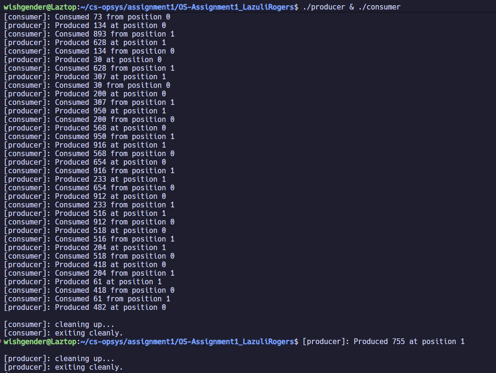

# OS-Assignment1_LazuliRogers
Assignment 1 for Operating Systems class at Kent State University

## Required Files

### Header

You will need `sharedTable.h`

### Source

You will need `producer.c` and `consumer.c`

## Build Instructions

### Compiling
```
gcc producer.cpp -pthread -lrt -o producer
gcc consumer.cpp -pthread -lrt -o consumer
```

## Execution Instructions

### Running
```
./producer & ./consumer 
```
The program will run a set number of times and then exit cleanly.

## Program Description

### Producer

`producer` generates the items (random integers from 0 to 999) and places them in the shared table. After running the number of times defined by `ITERATIONS` in `sharedTable.h`, the program exits, running `cleanup` and unmapping and closing the shared table, then closing and unlinking the semaphores.

### Consumer

`consumer` consumes the items generated by `producer` once they have been placed in the shared table.  After running the number of times defined by `ITERATIONS` in `sharedTable.h`, the program exits, running `cleanup` and unmapping and closing the shared table, then closing the semaphores. It does not need to unlink the semaphores, as that is already handled by `producer`.

### Expected Output

When properly executed, the output should look like this:

